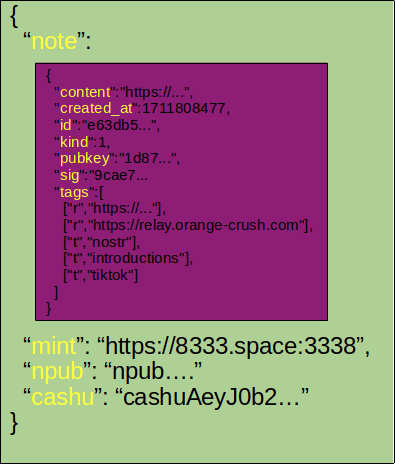
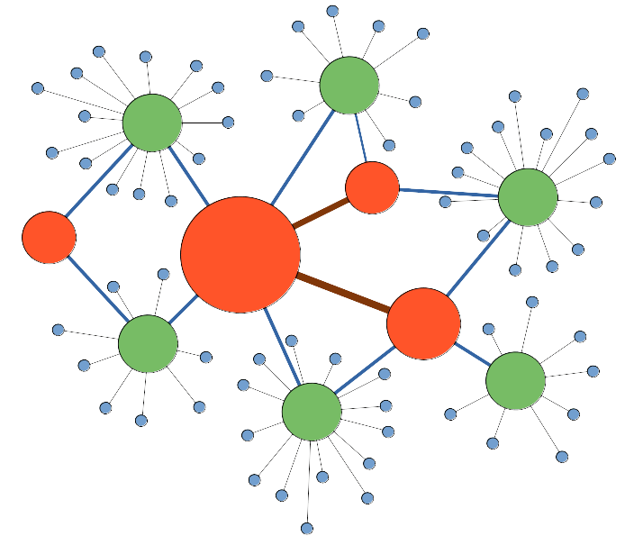

# The future of nostr is pay-to-post with P2PK
The transition of the early internet from a decentralized network to a centralized ecosystem provides several lessons for the development of the nostr protocol. It highlights the importance of resilience through distributed architecture, the need to balance convenience with decentralization to prevent centralization from re-emerging, and the management of complexity in ways that do not favor large entities. Economic incentives must be carefully designed to support decentralization, and navigating regulatory landscapes is crucial for maintaining openness. Additionally, the success of decentralized systems hinges on providing a seamless user experience to encourage widespread adoption. Finally, the open-source movement's role in fostering innovation and collaboration underscores the value of transparency and community engagement in the development of decentralized systems. In this post, I will be focusing on designing economic incentives that support decentralization. Asynchronous payment methods are beneficial to decentralized networks because they allow for transactions to be processed independently and without the need for immediate communication between the transacting parties. 

#### The struggle for incentives in decentralized systems is not new
The Cypherpunk movement, known for advocating the widespread use of strong cryptography and privacy-enhancing technologies, also explored the idea of creating an internet money system to be used as email server postage to combat spam. This concept envisioned a micropayment system where senders would pay a small fee to send emails, thereby discouraging mass spamming by making it economically unfeasible. *That cypher punk*, **Satoshi Nakomoto** solved the problem of a decentralized internet money, but in the end, email and web ended up becoming highly centralized communication systems based on a relatively few number of providers. Similarly, the tor project has failed to a functioning incentive system and therefore depends on donations relay and proxy operations.

#### Nostr relays
Relays come in two main flavors:
* Client-backing relays: [Damus client](wss://relay.damus.io) or [Primal client](wss://relay.primus.net) 
* Solo- or Community-hosted relays: [Bitcoiner.social](wss://nostr.bitcoiner.social) or the author's [Orange Crush Relay](wss://relay.orange-crush.com)

Relays can be as cheap as small 5$ VPS or a mega-sized bank account draining endeavor like Damus.io. Fees are typically associated with hosting fees and traffic fees both of which can scale quite exponentially as we add new users, but who pays? From the beginning, nostr protocol relays were not designed to be monetized. During the early days of nostr, "global" relay traffic could be monitored for interesting posts; however, the introduction of "Shower Girl" spam made it clear that a barrier to entry must be created to reduce spam.

This led to the integration of one-time payments into popular relay software [nostream](https://github.com/cameri/nostream). The one-time payment model worked to curb SPAM posts, but does not provide sufficient funding for running a large relay service. Next, nostr user [Mazin](nostr:npub18kzz4lkdtc5n729kvfunxuz287uvu9f64ywhjz43ra482t2y5sks0mx5sz) developed the [Nostr.wine](https://nostr.wine) monthly subscription-based relay with a premium filter displaying notes from your extended connected follow/er network. I'll leave it to Mazin to describe whether this is a fruitful endeavor. Profitability aside, the subscription model too closely resembles the centralized internet models we are seeking to escape through the decentralized design of the nostr protocol.

#### Nostr protocol requires a decentralized, asynchronous payment system
Asynchronous payments are advantageous with mobile clients because they allow for transactions to be processed without requiring both parties to be online simultaneously, which is particularly beneficial given the intermittent connectivity and varying network conditions often experienced by mobile devices. As nostr clients or microservices will often run on mobile devices, this approach enhances user experience by enabling transactions to proceed in the background, thereby reducing the need for immediate interaction and allowing for more efficient use of mobile network resources.

#### Lightning is not the solution for asynchronous micropayments
The Bitcoin Lightning Network is not a good fit for asynchronous small payments primarily because it requires both the sender and receiver to be online simultaneously for transactions to be completed. This synchronous requirement poses a significant challenge for mobile clients, which may not always have a stable internet connection or may be offline due to the device's power-saving modes or intermittent connectivity. Additionally, the Lightning Network's payment channels necessitate active management and liquidity, which can be complex and time-consuming, particularly for small payments that may not justify the overhead, a problem which will be exacerbated as bitcoin purchasing power increases.

#### Don't fret cypherpunks; This time *we have **all** the tools*
* A decentralized, uncensorable money: Bitcoin
* An asynchronous system for sending bitcoin-redeemable Ecash
* P2PK system for locking Ecash to a particular npub
* Services accepting payments for VPS hosting 

#### Asynchronous payments with Cashu
In September 2022, Nostr user [Calle](nostr:npub12rv5lskctqxxs2c8rf2zlzc7xx3qpvzs3w4etgemauy9thegr43sf485vg) introduced CashU Chaumian Ecash system. The Cashu protocol is an open-source ecash system designed for Bitcoin, utilizing the Blind Diffie-Hellman Key Exchange (BDHKE) for cryptographic security to sign and redeem ecash tokens, allowing for private and secure transactions without the need for personal information or accounts. It aims to enhance privacy and usability for Bitcoin users, offering a simpler layer two experience and enabling anyone to create a mint or choose an existing one for issuing or redeeming e-cash tokens. [BDHKE Documentation](https://github.com/cashubtc/nuts/blob/main/00.md).

#### Pay To Pubkey (P2PK)
In July 2023, the Pay to Pubkey (P2PK) feature was added to Cashu, which enhances security and privacy by allowing tokens to be locked to a specific public key. This ensures that only the intended recipient, who possesses the corresponding private key, can redeem the token, thereby preventing unauthorized access and redemption of tokens. The implementation of P2PK under NUT-11 enforces this contract at the mint level, requiring the recipient to provide a valid signature to redeem the locked token, which significantly improves the protocol's ability to securely and privately handle transactions. ([NUT-11 Documentation](https://github.com/cashubtc/nuts/blob/main/11.md)).

#### VPS hosts accepting bitcoin
* [Shinjiru](https://www.shinjiru.com)
* [Ultahost](https://ultahost.com/vps-hosting)
* [Cherry Servers](https://www.cherryservers.com)

#### Proposal: Ecash notes: incentivized post-to-relay

Signed nostr notes are enclosed in a JSON submission along with a mint to collect ecash, the P2PK npub the ecash is signed to (the relay's npub), and the P2PK-encrypted Ecash.

Proposed post dynamic:
1. User writes kind-01 note
2. Client signs note
3. Client wraps note in unique Ecash JSON submission for each relay
4. Client submits Ecash-wrapped notes to each relay
5. Relay receives, note, unlocks and verifies Ecash with mint, and publishes note.

The advantage of this proposed system is to provide relays with a natural incentive for existing. Nostr users can then choose relays based on cost and performance. In time, a fee market will develop. Relays may allow zero-fee traffic of their choosing (zaps, likes, nsecbunker requests, etc.)

#### Propsoal 2: Ecash negentropy negotiation: incentivized relay-to-relay syncing

The negentropy protocol on the [Strfry nostr relay](https://github.com/hoytech/strfry) is a set reconciliation protocol designed to efficiently synchronize stored messages between two parties, such as relays or clients. It operates over a Nostr protocol extension and allows for significant bandwidth savings by only exchanging the differences between the sets of messages that the two parties have, rather than transferring the entire set of messages or their identifiers. I propose that Ecash is utilized to monetize and coordinate note distribution between smaller relays (green) and larger distribution relays (red). In this way, smaller relays (green) collect Ecash & notes from users (blue) and pay some portion of the collected Ecash to distribution relays (red). Distribution relays may choose to monetize on a per sync or per MB synced basis. The intrinsic fee market of each activity is defined by the behavior of each member of the system: user, local relay, and distribution relay.

#### Final Thoughts
This proposal is to suggest that monetization is as critical as the nostr protocol design itself. An **incentivized** decentralized communication protocol will fundamentally reverse the trend towards centralization, censorship, and loss of sovereignty. In the proposed system each party (user, relay, and distribution relay) considers the value of the services rendered, the underlying cost to complete said service, and the competitive landscape of other providers. This system should collapse to commodification as competition increases. At maturity, operators should be able to rapidly spin up services with as little as a bitcoin-accepting VPS provider, a github repo, a trusted Cashu mint, and an npub for the operation. As the nostr protocol scales in usage, the proposed in-built incentives will promote decentralized infrastructure scaling so that we won't have to depend on venture captial, public donations, or a benefactor like [Jack](nostr:npub1sg6plzptd64u62a878hep2kev88swjh3tw00gjsfl8f237lmu63q0uf63m).

Thanks for reading if you made it this far! Please share feedback. **Incentive is not a dirty word.** If we get incentivized relays right, **the nostr protocol will win** because it will sustain itself.
